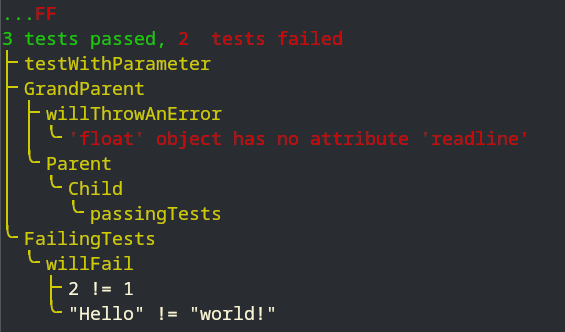

# pyTesting

pyTesting provides basic functionalities to create Python tests. It is minimalistic but effective in what it does.

It classifies each test in a clear hierarchy and displays the results in a tree diagram.



## Usage

To create a test, you need to first reference the function in `Testing`. Then, you can use `Testing.test(statement, message)`. `Testing.test()` works in assert style. If the statement is true, then the test passes; else, the test fails.
```py
@Testing.reference
def test(a):
    Testing.test(a == 1,
                 f"{a} != 1"
        )
```

You can have multiple tests in one test function.
```py
@Testing.reference
def test(a):
    Testing.test(a == 1,
                 f"{a} != 1"
        )
    Testing.test((a + 2) == 3,
                 f"{a + 2} != 3"
        )
```

When all tests have been executed, you can use the `Testing.display()` function. It will display the results of the tests, the failing test messages, and any eventual errors.
```py
@Testing.reference
def test(a):
    Testing.test(a == 1,
                 f"{a} != 1"
        )
    Testing.test((a + 2) == 3,
                 f"{a + 2} != 3"
        )

test(1)

Testing.display()
```

You can modify some behaviors of pyTesting.
```py
Testing.displayLiveResults(True | False) # Display / Hide the '.'/'F' printed while testing, default is True
Testing.catchErrors(True | False) # Catch errors in referenced test functions, default is True
```

See `example_tests.py` for a "full" example of `pyTesting` usage.

## Why?

I needed a really simple and relatively fast testing framework for a project. The already existing ones were too burdensome and not portable enough. As I divide my tests into multiple files, and for the sake of simplicity, I chose that `Testing` should not be instantiated and to use it more as a "namespace" than really a Python class.